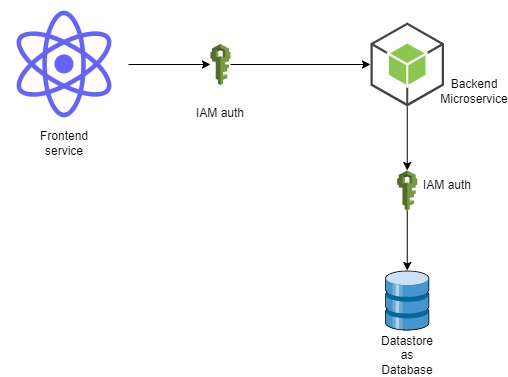

# Message service

This application is used to post user messages from React frontend. Past messages can be listed and deleted from the list.

Message can be checked if it's a a palindrome or not.

## To start the Application in root folder execute

### For Linux

    make up

### For windows

    docker-compose build && docker-compose up -d

## Follow following steps to use application 

1. Acess front end service at

    http://localhost:3000

2. Backend apis swagger documentaion can be seen at

    http://localhost:3003/docs/

3. Database can be seen at 

    http://localhost:8282

4. To see logs of any service, execute follwing 

    docker-compose logs --follow message-service
    docker-compose logs --follow message-service-dashboard

## Architecture

